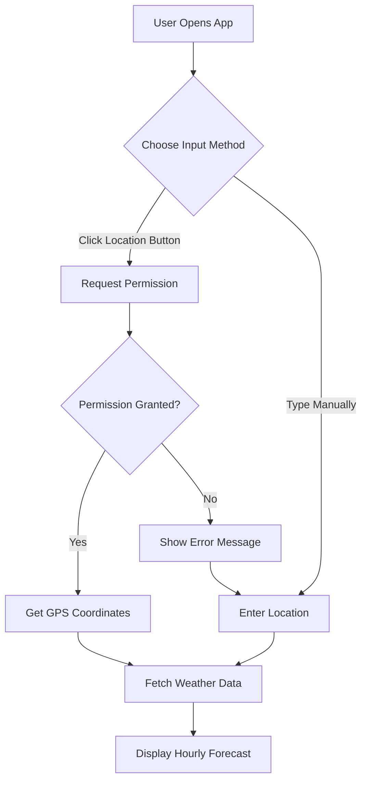

# Geolocation Feature Preview

## User Interface Design

### Search Bar Layout
```
┌─────────────────────────────────────────────────────────┐
│  🌍 Hourly Weather Forecast                             │
├─────────────────────────────────────────────────────────┤
│                                                          │
│  ┌──────────────────────────────┐  ┌──────┐  ┌────────┐│
│  │ Enter city, ZIP, or coords   │  │  📍  │  │ Search ││
│  └──────────────────────────────┘  └──────┘  └────────┘│
│   Text Input Field                 Location   Submit    │
│                                    Button     Button    │
└─────────────────────────────────────────────────────────┘
```

## Feature Behavior

### 1. Initial State
- Location button shows a pin icon (📍)
- Tooltip: "Use my location"
- Button is enabled and clickable

### 2. User Clicks Location Button

**Step 1: Permission Request**
```
Browser prompts: "example.com wants to know your location"
[Block] [Allow]
```

**Step 2: Loading State**
- Button shows loading spinner
- Button text: "Detecting..."
- Input field is disabled temporarily

### 3. Success Scenario

**If user allows location:**
```javascript
// Browser provides coordinates
latitude: 28.6139
longitude: 77.2090

// App uses coordinates to fetch weather
API call: ?q=28.6139,77.2090

// Display shows:
"📍 New Delhi, India"
[24-hour forecast cards displayed below]
```

### 4. Error Scenarios

**If user denies permission:**
```
⚠️ Location access denied. Please enter a location manually.
```

**If geolocation not supported:**
```
⚠️ Geolocation is not supported by your browser.
```

**If location detection fails:**
```
⚠️ Unable to detect location. Please try again or enter manually.
```

## Technical Implementation

### HTML Structure
```html
<div class="search-container">
  <input 
    type="text" 
    id="locationInput" 
    placeholder="Enter city, ZIP, or coordinates"
  />
  <button 
    id="geolocateBtn" 
    class="btn-geolocation"
    title="Use my location"
  >
    📍
  </button>
  <button id="searchBtn" class="btn-search">
    Search
  </button>
</div>
```

### JavaScript Flow
```javascript
// 1. User clicks geolocation button
geolocateBtn.addEventListener('click', () => {
  if (navigator.geolocation) {
    // Show loading state
    geolocateBtn.innerHTML = '⏳';
    geolocateBtn.disabled = true;
    
    // Request location
    navigator.geolocation.getCurrentPosition(
      // Success callback
      (position) => {
        const lat = position.coords.latitude;
        const lon = position.coords.longitude;
        
        // Fetch weather using coordinates
        fetchWeather(`${lat},${lon}`);
        
        // Reset button
        geolocateBtn.innerHTML = '📍';
        geolocateBtn.disabled = false;
      },
      // Error callback
      (error) => {
        handleGeolocationError(error);
        geolocateBtn.innerHTML = '📍';
        geolocateBtn.disabled = false;
      }
    );
  } else {
    showError('Geolocation not supported');
  }
});
```

### Error Handling
```javascript
function handleGeolocationError(error) {
  switch(error.code) {
    case error.PERMISSION_DENIED:
      showError('Location access denied');
      break;
    case error.POSITION_UNAVAILABLE:
      showError('Location unavailable');
      break;
    case error.TIMEOUT:
      showError('Location request timed out');
      break;
    default:
      showError('Unknown error occurred');
  }
}
```

## User Experience Flow

### Scenario 1: First-time User
1. User lands on page
2. Sees location button with pin icon
3. Clicks location button
4. Browser asks for permission
5. User allows
6. App detects location (e.g., "Mumbai, India")
7. Hourly forecast loads automatically
8. Success! ✅

### Scenario 2: Manual Entry User
1. User prefers to type location
2. Ignores location button
3. Types "London" in input field
4. Clicks Search button
5. Hourly forecast loads for London
6. Success! ✅

### Scenario 3: Permission Denied
1. User clicks location button
2. Browser asks for permission
3. User clicks "Block"
4. Error message appears
5. User can still use manual input
6. Types location manually
7. Success! ✅

## Visual Design

### Button States

**Normal State:**
```css
.btn-geolocation {
  background: #4CAF50;
  color: white;
  border-radius: 8px;
  padding: 12px 16px;
  cursor: pointer;
  font-size: 20px;
}
```

**Hover State:**
```css
.btn-geolocation:hover {
  background: #45a049;
  transform: scale(1.05);
}
```

**Loading State:**
```css
.btn-geolocation.loading {
  background: #9E9E9E;
  cursor: wait;
  animation: pulse 1.5s infinite;
}
```

**Disabled State:**
```css
.btn-geolocation:disabled {
  background: #CCCCCC;
  cursor: not-allowed;
  opacity: 0.6;
}
```

## Mobile Responsiveness

### Desktop View (>768px)
```
[Input Field - 60%] [Location - 15%] [Search - 25%]
```

### Mobile View (<768px)
```
[Input Field - 100%]
[Location - 50%] [Search - 50%]
```

## Accessibility Features

1. **Keyboard Navigation**
   - Tab to location button
   - Enter/Space to activate

2. **Screen Reader Support**
   ```html
   <button 
     aria-label="Use my current location"
     title="Use my location"
   >
     📍
   </button>
   ```

3. **Visual Feedback**
   - Clear loading states
   - Error messages with icons
   - Success confirmation

## Privacy & Security

### User Privacy
- Location is only requested when user clicks button
- Coordinates are sent directly to WeatherAPI
- No location data is stored locally
- User can deny permission anytime

### Browser Compatibility
- ✅ Chrome 5+
- ✅ Firefox 3.5+
- ✅ Safari 5+
- ✅ Edge 12+
- ✅ Opera 10.6+
- ⚠️ Requires HTTPS in production

## Benefits

1. **Convenience**: One-click weather for current location
2. **Speed**: Faster than typing location name
3. **Accuracy**: Uses precise GPS coordinates
4. **Fallback**: Manual input still available
5. **User Control**: Permission-based, not automatic

## Example User Journey



## Summary

The geolocation feature provides a seamless, one-click solution for users to get weather forecasts for their current location, while maintaining full fallback support for manual location entry. It enhances user experience without compromising privacy or accessibility.